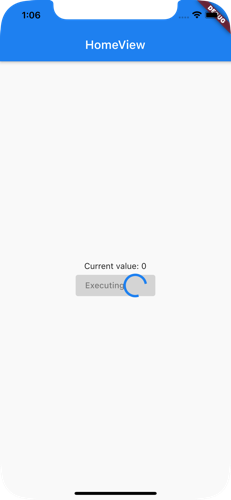
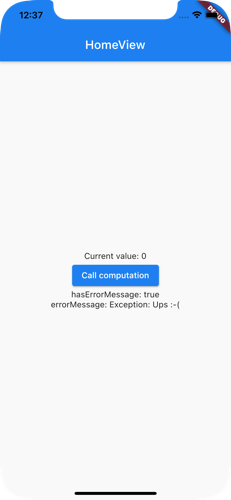

# get_command

[](https://pub.dartlang.org/packages/get_command)

This library helps providing feedback to the user while executing a controller function.
It is intended to be used with the [Get](https://pub.dev/packages/get) library. 

Let's create an example to showcase the usage:

1. Create a controller with an async function 'longRunningTask':

``` 
import 'package:get/get.dart';

class HomeController extends GetxController {
  final count = 0.obs;

  @override
  void onInit() {
    super.onInit();
  }

  @override
  void onReady() {
    super.onReady();
  }

  @override
  void onClose() {}

  Future<void> longRunningTask() async {
    await Future.delayed(Duration(seconds: 1));
    count.value++;
  }
}

```

2. Create a simple view
   
``` 
import 'package:flutter/material.dart';
import 'package:get/get.dart';

import '../controllers/home_controller.dart';

class HomeView extends GetView<HomeController> {
  @override
  Widget build(BuildContext context) {
    return Scaffold(
      appBar: AppBar(
        title: Text('HomeView'),
        centerTitle: true,
      ),
      body: Center(
        child: Column(
          mainAxisAlignment: MainAxisAlignment.center,
          children: [
            Obx(() {
              return Text("Current value: ${controller.count}");
            }),
            ElevatedButton(
                child: const Text("Start long running task"),
                onPressed: controller.longRunningTask),
          ],
        ),
      ),
    );
  }
}

```

The problem with this code is that user can tap the button again while the longRunningTask function is currently beening executed.

Let's extend the controller to use a GetCommand:

``` 
import 'dart:async';

import 'package:get/get.dart';
import 'package:get_command/get_command.dart';

class HomeController extends GetxController {
  final count = 0.obs;
  final GetCommand cmdLongRunningTask = GetCommand();

  HomeController() {
    cmdLongRunningTask.commandFunc = _longRunningTask;
  }

  @override
  void onInit() {
    super.onInit();
  }

  @override
  void onReady() {
    super.onReady();
  }

  @override
  void onClose() {
    cmdLongRunningTask.dispose();
  }


  FutureOr<void> _longRunningTask() async {
    await Future.delayed(Duration(seconds: 1));
    count.value++;
  }
}
```
What changed:
1. A new field ```final GetCommand cmdLongRunningTask = GetCommand();``` has been created.
2. During construction time we set the ```cmdLongRunningTask.commandFunc = _longRunningTask;```. That way we tell the command which function should be executed.
3. OnClose() calls ```cmdLongRunningTask.dispose()``` to release any resources.


Next we update the HomeView to use the Command:

``` 
import 'package:flutter/material.dart';
import 'package:get/get.dart';
import 'package:get_command_example/app/modules/home/controllers/home_controller.dart';

class HomeView extends GetView<HomeController> {
  @override
  Widget build(BuildContext context) {
    return Scaffold(
      appBar: AppBar(
        title: Text('HomeView'),
        centerTitle: true,
      ),
      body: Center(
        child: Column(
          mainAxisAlignment: MainAxisAlignment.center,
          children: [
            Obx(() {
              return Text("Current value: ${controller.count}");
            }),
            Obx(() {
              return ElevatedButton(
                onPressed: controller.cmdLongRunningTask.canBeExecuted
                    ? controller.cmdLongRunningTask.exec
                    : null,
                child: controller.cmdLongRunningTask.executing
                    ? Row(mainAxisSize: MainAxisSize.min, children: [
                        const Text('Executing'),
                        const CircularProgressIndicator(),
                      ])
                    : const Text('Call computation'),
              );
            }),
          ],
        ),
      ),
    );
  }
}
```

In that way the button is displayed as disabled and also a litte animation is displayed.



Use
``` 
controller.cmdLongRunningTask.exec
```

instead of

``` 
controller.cmdLongRunningTask.commandFunc
```
to assign the ```onPressed``` event handler.


The ```exec``` function calls the ```commandFunc``` function. 


In the case your controller function throws an exception you have three options to handle that:
1. Automatically: it will be catched and the ```errorMessage``` property has a value of ```catchedException.toString()``` and the ```hasErrorMessage``` property is set to ```true```. Here an example:

Within the ```_longRunningTask``` throw an exception: 
``` 
  FutureOr<void> _longRunningTask() async {
    await Future.delayed(Duration(seconds: 1));
    throw Exception('Ups :-(');
    count.value++;
  }
  
```

since it is not catched, the Command handles it.
Lets extend the view to display the error message:

```
class HomeView extends GetView<HomeController> {
  @override
  Widget build(BuildContext context) {
    return Scaffold(
      appBar: AppBar(
        title: Text('HomeView'),
        centerTitle: true,
      ),
      body: Center(
        child: Column(
          mainAxisAlignment: MainAxisAlignment.center,
          children: [
            Obx(() {
              return Text("Current value: ${controller.count}");
            }),
            Obx(() {
              return ElevatedButton(
                onPressed: controller.cmdLongRunningTask.canBeExecuted
                    ? controller.cmdLongRunningTask.exec
                    : null,
                child: controller.cmdLongRunningTask.executing
                    ? Row(mainAxisSize: MainAxisSize.min, children: [
                        const Text('Executing'),
                        const CircularProgressIndicator(),
                      ])
                    : const Text('Call computation'),
              );
            }),          
            Obx(() {
              return Text(
                  "hasErrorMessage: ${controller.cmdLongRunningTask.hasErrorMessage}");
            }),

            Obx(() {
              return Text(
                  "errorMessage: ${controller.cmdLongRunningTask.errorMessage}");
            }),
          ],
        ),
      ),
    );
  }
}

```



2. The ```_longRunningTask()``` catches the exception and sets the ``errorMessage`` via the ```setState(...)```:
    
```
  FutureOr<void> _longRunningTask() async {
    try {
      await Future.delayed(Duration(seconds: 1));
      throw Exception('Ups :-(');
      count.value++;
    } on Exception catch (e) {
      cmdLongRunningTask.setState(
          errorMessage: 'Something went wrong, try again.');
    }
  }
```
3. The GetCommand has a optional ```errorMessageProviderFunc ``` callback function. The function signature is defined as:

```
typedef ErrorMessageProvider = FutureOr<String> Function(Exception exception);
```

That callback function will be called to get an error message for the given exception.

Let implement such a function within the controller:

I create a dedicated exception:
```
class OhNoException implements Exception {}
```
that will be thrown within the ```_longRunningTask()```function:
```
  FutureOr<void> _longRunningTask() async {
    await Future.delayed(Duration(seconds: 1));
    throw OhNoException();
    count.value++;
  }
```
I create function that have the ```ErrorMessageProvider``` signature:
```
  FutureOr<String> _getErrorMessageFor(Exception exception) {
    var errorMessage = '';
    
    switch (exception.runtimeType) {
      case OhNoException:
        errorMessage = 'Oh no - what a mess, try again.';
        break;
      default:
        errorMessage = 'Something went wrong :-(';
    }

    return errorMessage;
  }
```
and assigne that function to the ```errorMessageProviderFunc```property of the GetCommand within the constructor:

```
  HomeController() {
    cmdLongRunningTask.commandFunc = _longRunningTask;
    cmdLongRunningTask.errorMessageProviderFunc = _getErrorMessageFor;
  }
```

I Hope that GetCommand class is of any help for you. 